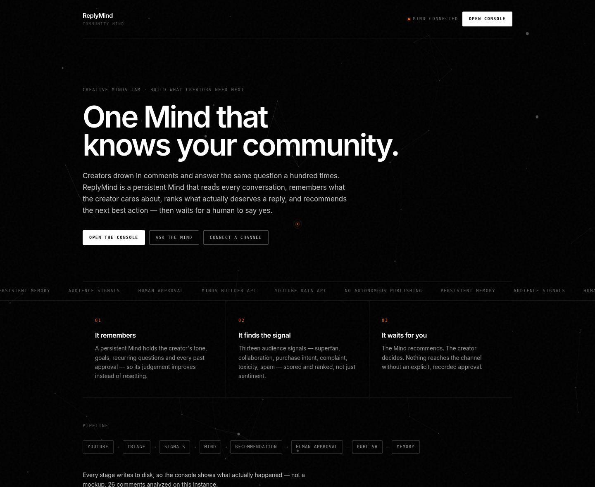
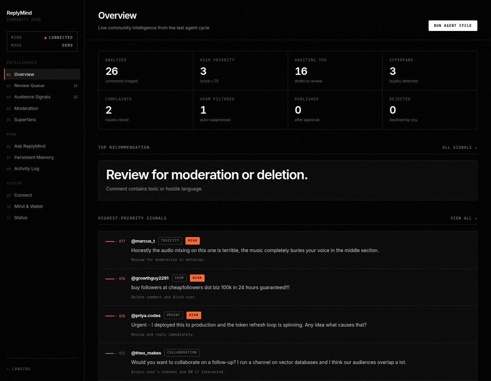
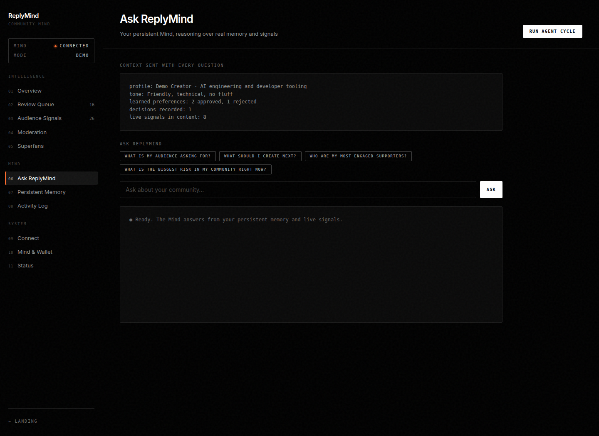
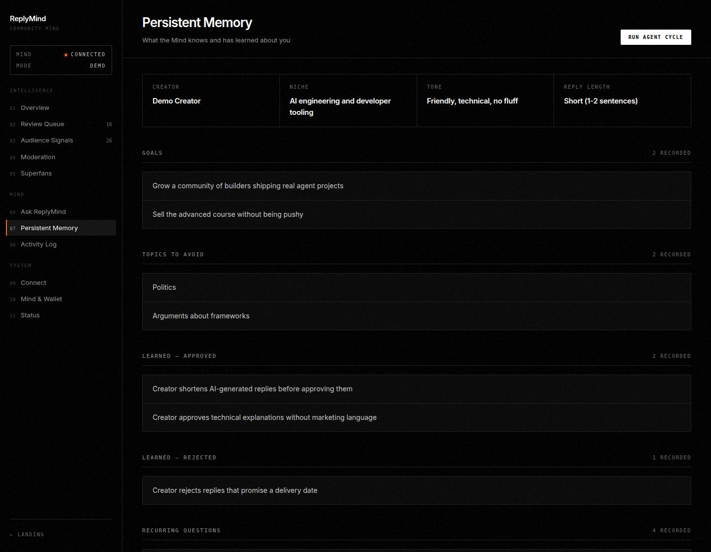
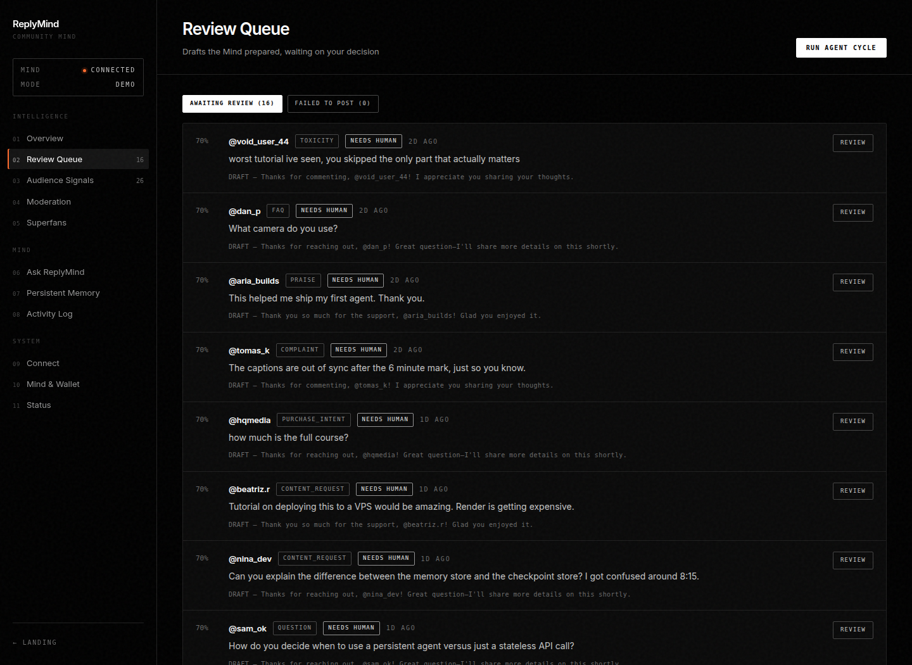
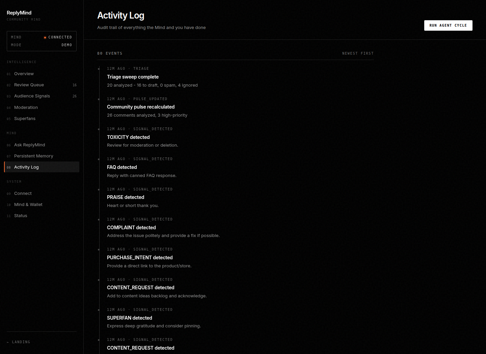
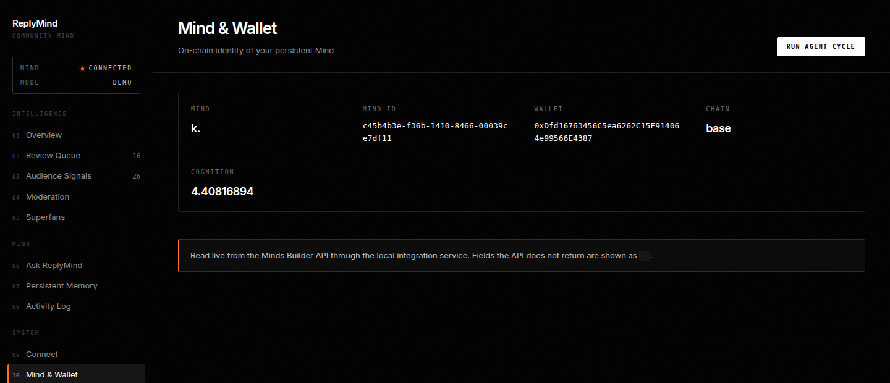

# ReplyMind

**A persistent Mind that knows your community.**

Creators drown in comments and answer the same question a hundred times. ReplyMind is a persistent
Mind — built on the [Minds Builder API](https://build.hellominds.ai/) — that reads every conversation,
remembers what the creator cares about, ranks what actually deserves a reply, recommends the next best
action, and then **waits for a human to say yes**.

Built for [Creative Minds Jam #1](https://dorahacks.io/hackathon/creativeminds/detail) —
*Build what creators need next.*



---

## Try it in 60 seconds — no credentials needed

```bash
pip install -r requirements.txt
REPLYMIND_MODE=demo ./run-ui.sh          # Windows: run-ui.bat
```

Open <http://127.0.0.1:8000> and press **Run Agent Cycle**.

Demo mode runs the *entire* pipeline on 20 seeded comments — triage, deduplication, signal detection,
priority scoring, reply drafting, community pulse — with no YouTube OAuth, no API keys, and no ability
to publish anything. Every number on every page comes from that run.

To connect the real Mind and a real channel, see [Production setup](#production-setup).

---

## What it does

| | |
|---|---|
| **It remembers** | A persistent Mind holds the creator's tone, goals, recurring questions and every past approval. Its judgement improves instead of resetting each session. |
| **It finds the signal** | Thirteen audience signals — superfan, collaboration, purchase intent, content request, complaint, toxicity, spam, urgent, FAQ, trend — scored 0–100 across five weighted dimensions. Not just sentiment. |
| **It waits for you** | The Mind recommends. The creator decides. Nothing reaches the channel without an explicit, recorded approval, and the publish route is authenticated. |

### The Mind is the product, not a wrapper

Every question you ask goes to the persistent Mind with real context attached — the creator profile,
learned preferences, decision history, the live community pulse, and the top-priority signals with
their evidence:

```
CREATOR: Demo Creator | niche=AI engineering | tone=Friendly, technical, no fluff
LEARNED (approved): Creator shortens AI-generated replies before approving them
LEARNED (rejected): Creator rejects replies that promise a delivery date
COMMUNITY PULSE: 20 analyzed, 3 high-priority, 3 content requests, 2 complaints, 3 superfans
TOP LIVE SIGNALS:
  - [URGENT p76] @priya.codes: "Urgent - I deployed this and the token refresh loop is spinning"
  - [COLLABORATION p72] @theo_makes: "Would you want to collaborate on a follow-up?"
  - [CONTENT_REQUEST p67] @mira_builds: "Can you make a video on how you structure the backend?"
```

A single stable conversation alias (`replymind-console`) keeps that thread continuous across sessions —
which is what makes it a persistent Mind rather than a stateless classifier.

**When the Mind is unreachable, ReplyMind says so.** It never fabricates a reasoning trace, a wallet
address, or a cognition balance to fill the gap.

---

## Screenshots

| Overview | Audience signals |
|---|---|
|  |  |

| Ask the Mind | Persistent memory |
|---|---|
|  |  |

| Review queue | Activity log |
|---|---|
|  |  |

The Mind's on-chain identity, read live from the Minds Builder API — no placeholder
values, and an explicit "unreachable" state when the service is down:



> All captured from a live run with `./scripts/screenshots.sh` — a connected Mind and a real
> demo-mode agent cycle. Every number shown came out of that run.

---

## Architecture

```
YouTube Data API ─┐
                  ├─→ Fetch ─→ Dedupe ─→ Triage ─→ Signal detection ─→ Priority scoring
Demo seed data ───┘                        │                               │
                                           │                               ▼
                                           │                       Community pulse
                                           ▼                               │
                                  ┌────────────────────┐                   │
                                  │  PERSISTENT MIND   │ ←─────────────────┘
                                  │ (Minds Builder API)│ ←── Persistent memory
                                  └────────┬───────────┘
                                           │ reasoning + recommendation
                                           ▼
                                    Review console
                                           │
                                    HUMAN APPROVAL  ← authenticated, recorded
                                           │
                              ┌────────────┴────────────┐
                              ▼                         ▼
                      Publish to YouTube        Write back to memory
```

Every stage writes to `runtime/`, so the console shows what actually happened.

### Layout

```
app/
  paths.py            Single source of truth for runtime paths
  agent/
    agent_service.py  The one path to the Mind — used by UI and monitor alike
    minds_client.py   HTTP client for the integration service
    memory.py         Persistent creator profile, preferences, decisions
    signal_store.py   Detected audience signals
    activity_log.py   Append-only audit trail
    community_pulse.py
  ai/
    triage_engine.py  Spam/relevance/category classification
    opportunity_detector.py  13 audience signals
    scoring.py        Weighted 0–100 priority
    batch_drafter.py  Reply generation with guardrails
  youtube/            OAuth'd Data API client, fetcher, poster
  review/
    webapp.py         FastAPI console
    design.py         Design system
  demo/seed.py        Seeded comments for credential-free demo
minds-service/        Node service wrapping @animocabrands/minds-client-lib
```

---

## Production setup

### 1. Minds integration service

The Builder API key lives only in this Node service — never in the Python process, never in a browser.

```bash
cd minds-service
npm install
npm start          # listens on :3001
```

### 2. Create your Mind

At [build.hellominds.ai](https://build.hellominds.ai/), create a Mind named **ReplyMind** and instruct
it to act as a persistent community manager that analyses audience signals, remembers creator context,
and recommends actions. Note the **Mind ID** and generate a **Builder API key**.

### 3. Configure

```bash
cp .env.example .env
```

| Variable | Purpose |
|---|---|
| `REPLYMIND_MODE` | `demo` (default) or `production` |
| `MINDS_BUILDER_API_KEY` | Minds Builder key — server-side only |
| `MINDS_MIND_ID` | Your Mind's ID |
| `OPENAI_API_KEY` | Reply drafting |
| `YT_CLIENT_ID` / `YT_CLIENT_SECRET` / `YOUTUBE_CHANNEL_ID` | YouTube OAuth |
| `REPLYMIND_CONSOLE_TOKEN` | **Required in production.** Gates every publish action. |

### 4. Authorise YouTube

```bash
python auth_youtube.py     # writes secrets/refresh_token.txt
```

### 5. Run

```bash
REPLYMIND_MODE=production ./run-ui.sh
python -m app.monitor      # optional: poll on a schedule
```

---

## Safety model

- **No autonomous publishing.** `ActionStateMachine` refuses to reach `EXECUTED` from any state but
  `APPROVED`, and demo mode cannot construct a YouTube poster at all.
- **Authenticated approval.** Approving posts a real comment to a real channel, so `/refresh` and every
  `/draft/*` route requires an operator session. Production **refuses to start serving those routes**
  if `REPLYMIND_CONSOLE_TOKEN` is unset rather than leaving them open.
- **Recorded decisions.** Every approval and rejection is written to the activity log and back into
  memory, so the audit trail and the Mind's learning come from the same source.
- **Server-side secrets.** The Builder API key is read only by `minds-service`. `.env`, `secrets/` and
  `runtime/` are git-ignored.
- **Honest degradation.** An unreachable Mind produces an error message, never invented output.

---

## Development

```bash
pytest                     # 76 tests
ruff check .               # lint (rule set pinned in pyproject.toml)
./scripts/screenshots.sh   # regenerate README images
```

CI runs lint, tests, and a smoke test that proves a fresh clone completes a full demo cycle with no
credentials.

---

## Built with

Python · FastAPI · Pydantic · Node 22 · TypeScript · Express ·
[`@animocabrands/minds-client-lib`](https://build.hellominds.ai/en/docs/get-started/client-library) ·
OpenAI API · YouTube Data API v3

**Documentation:** [Minds Builder API](https://build.hellominds.ai/en/docs) ·
[Client library](https://build.hellominds.ai/en/docs/get-started/client-library)
